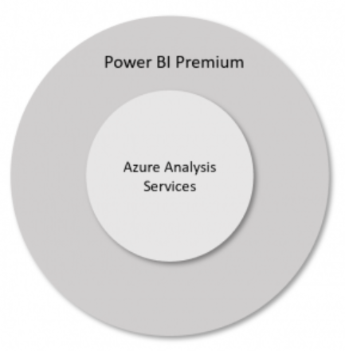

##  Azure Analysis Services or Power BI Premium?

It can sometimes be difficult to decide between enterprise BI solutions. Power BI Premium provides the richest set of capabilities for both self-service and enterprise BI solutions. However, Azure Analysis Services also represents an interesting BI alternative. So how do you decide?
 
 

###  Power BI Premium

 **Power BI Premium** is a hosted service (SaaS) that allows you to host datasets and share Power BI reports and dashboards with anyone in your organization without requiring recipients to be individually licensed. Power BI Premium provides dedicated hardware and capacity hosted by Microsoft for reliable and consistent performance. This dedicated capacity can be scaled up or down according to your business needs. In addition to datasets, Power BI Premium includes several other workloads including dataflows, paginated reports, and AI.

 **Resource:** Step-by-step guide on how to implement [Incremental Refesh with Power BI Premium](https://github.com/matthewrodin/PowerBIPremium-IncrementalRefresh)
 
 

###  Azure Analysis Services

Analysis Services tabular models can be created and deployed in **Azure Analysis Services**. With Azure Analysis Services, almost all tabular models can be moved into Azure with few, if any, changes. There are multiple deployment options and service tiers within each option that you can tailor to meet your requirements. In less than a minute, you can configure the service tier you require in the Azure Portal. Note that multi-dimensional models are not yet supported in Azure Analysis Services.

 **Resource:** Step-by-step guide on how to implement [Sliding Window Partitioning with Azure Analysis Services](https://github.com/matthewrodin/AzureAnalysisServices-SlidingWindowPartitioning)
 
 

###  Feature Considerations

With a few exceptions, Power BI Premium provides a superset of the capabilities available in Azure Analysis Services. In time, these exceptions will be eliminated making Power BI Premium a clearly superior choice when considering capabilities alone.

The table below lists where the significant differences exist between the two offerings:
 
 

* **Unlimited Power BI Report content viewing** is the capability to share a report or dashboard with everyone in an organization. Absent this capability, each user must possess a license to view the dashboard or report.

* **Paginated Reports** is the standard report format in SQL Server Reporting Services and is available in Power BI Premium.

* **Dataflows** provide self-service data prep capabilities for big data in Power BI.

* **AI Workload** lets you use cognitive services and Automated Machine Learning in Power BI.

* **Multi-model memory management:** The total size of models in Azure Analysis Services cannot exceed the memory available in the chosen configuration. In Power BI Premium, models are loaded in memory as required and evicted when not in use providing a more efficient use of memory resources.

* **Pre-aggregated tables** are tables that contain aggregates of other tables. Depending on the size of the base table, queries that can be resolved using the pre-aggregated tables can perform much, much faster than otherwise.

* **Composite models** are individual datasets that support tables with direct query, import, or both – all in a single dataset.

* **Automated incremental refresh** allows datasets to be updated with only changed data rather than refreshing the entire dataset.

* **Large datasets** is the ability to host datasets as large as memory is available.  In Power BI Premium, the limit was 10GB but this ceiling has since been removed (this capability is in preview).
 

* **Third party application support** means applications other than Power BI can be used to query and manage datasets with an XML/A endpoint.

* **Scale Out** enables client query distribution across query replicas, reducing response times for high-concurrency workloads. Scale out is not yet available in Power BI Premium but is planned for mid to late 2020.

* **Bring Your Own Key** gives you the ability to control the encryption keys for your Power BI data at-rest. This is available in preview.

* **Metadata Translations** provide the ability to support many different languages of model names, table names, and column names that are automatically included in reports and dashboards based on a customer’s locale.

* **Object Level Security** provides table and column level security on tabular models.

* **Perspectives** define viewable subsets of a model that provide focused, business-specific, or application-specific viewpoints.

###  Cost Considerations
**Power BI Premium** is, as the name suggests, the premium offering for enterprise and self service BI. Power BI Premium is licensed by capacity and you pay for as much dedicated capacity as you need. Any users can consume Power BI content – only authors require an individual Power BI license.

**Azure Analysis Services** is available in Developer, Basic and Standard service tiers. Within each tier exists several more instance types with different processing and memory options depending on your data and query processing workload. You can pause and restart Azure Analysis Services and no costs accrue when it is not running. However, any Power BI licenses must be purchased separately.
 
 

###  Key Takeaway

1. There are a few capabilities where Azure Analysis Services satisfies requirements not yet generally available (GA) in Power BI Premium. If you require very large datasets or query scale out today, Azure Analysis Services might be your preferred solution. However, these features will soon be matched or exceeded in Power BI Premium.

2. Power BI Premium is the enterprise platform for modern enterprise cloud BI applications. Analysis Services is the engine powering this platform. While Power BI Premium has (and will continue to have) additional capabilities for performance, scale, and management, the engine itself may satisfy your needs. Both are excellent and the choice between the two options is dependent on your business requirements.

Power BI Premium is the focus for enterprise BI and the primary target for future investments. In time, Power BI Premium will provide a *superset* of the capabilities when compared to Azure Analysis Services.

The clear future direction is **Power BI Premium**.
 

###  Resources

* [Power BI Premium and Azure Analysis Services](https://powerbi.microsoft.com/en-us/blog/power-bi-premium-and-azure-analysis-services/)

* [Power BI Premium](https://docs.microsoft.com/en-us/power-bi/service-premium-what-is)

* [Power BI Pricing](https://powerbi.microsoft.com/en-us/pricing/)

* [Azure Analysis Services](https://docs.microsoft.com/en-us/azure/analysis-services/analysis-services-overview)

* [Azure Analysis Services Pricing](https://azure.microsoft.com/en-us/pricing/details/analysis-services/)
